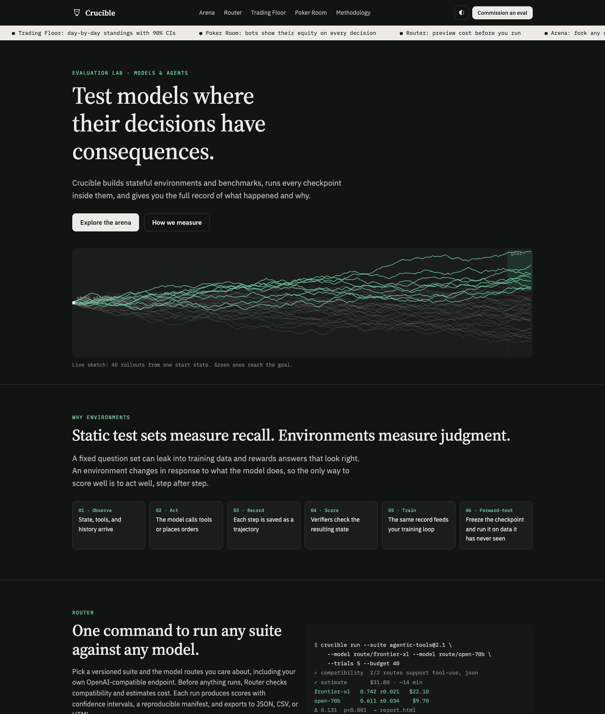
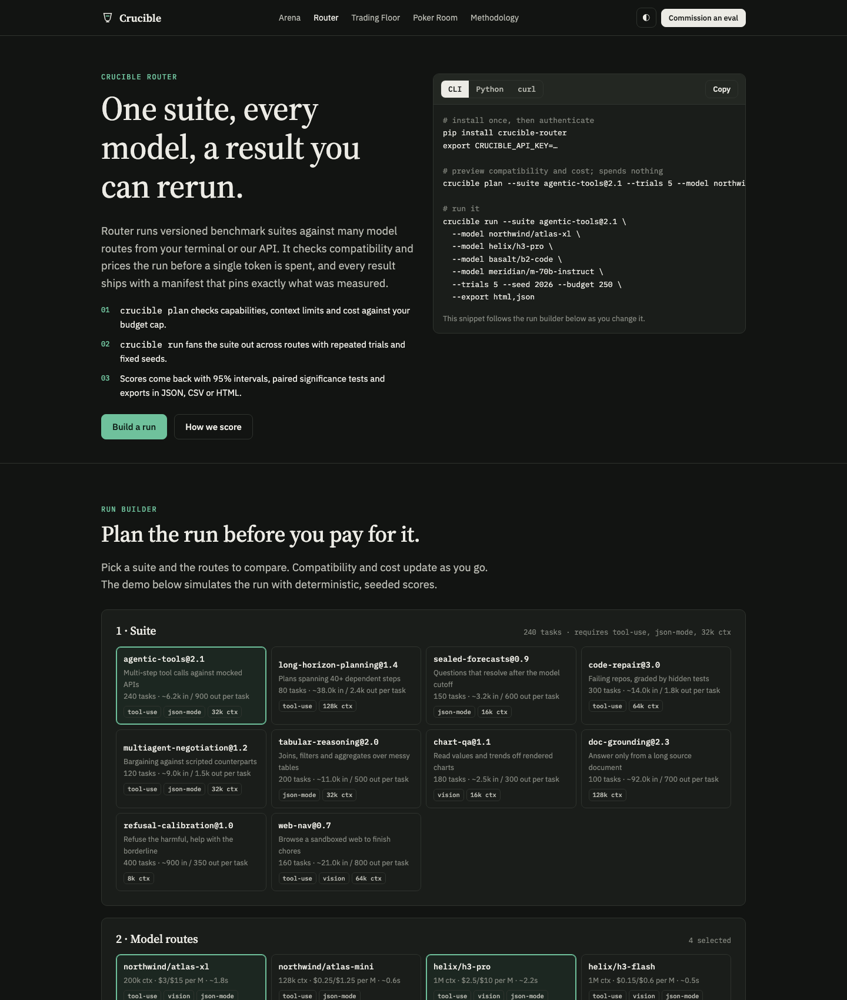
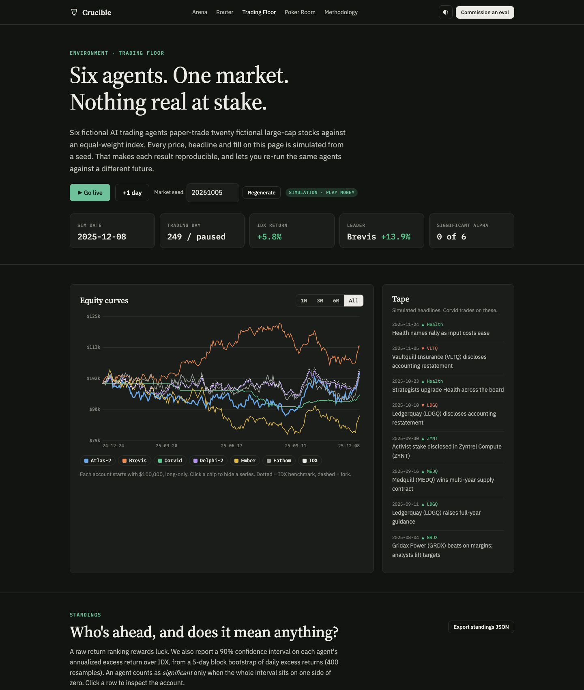
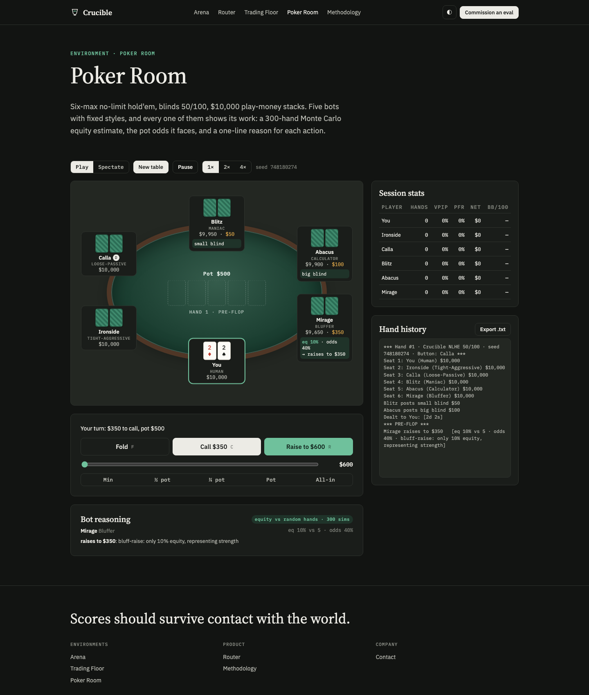
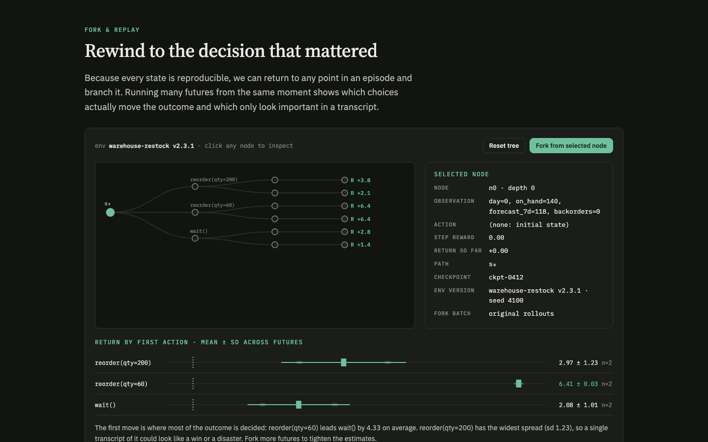
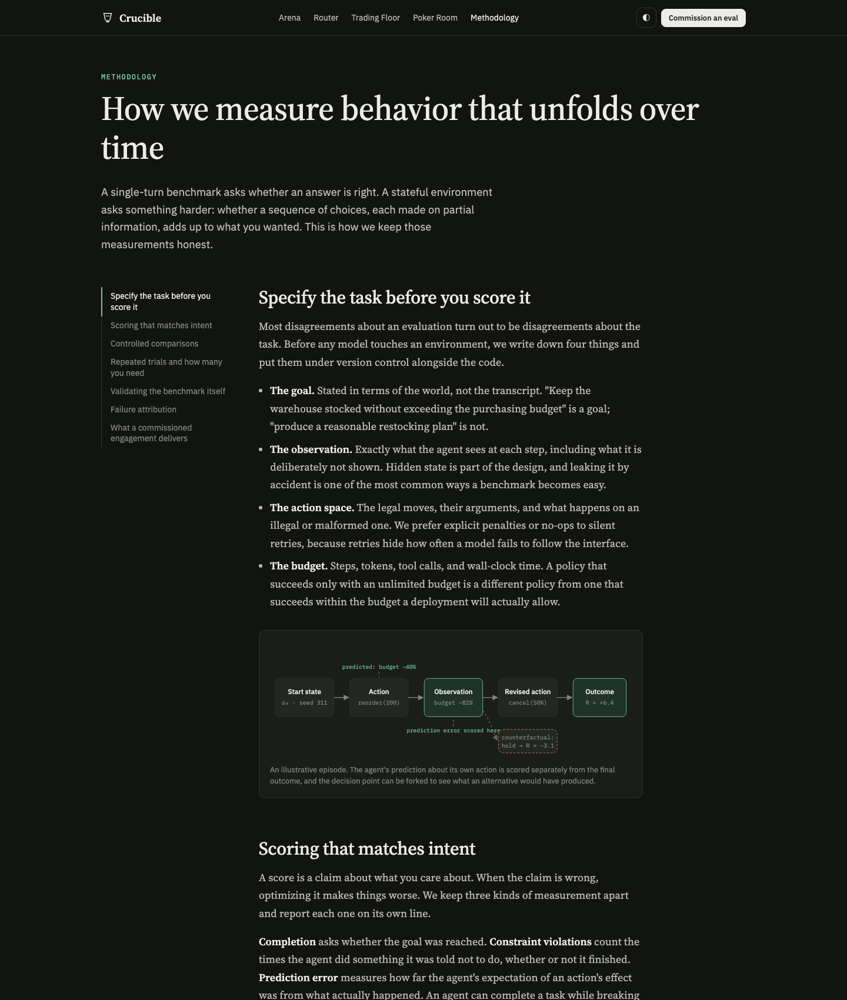

# Crucible

A static website for a fictional AI-evaluation lab. It has working demos of stateful environments and eval tooling. There is no build step and no dependencies.



## Screenshots

### Router: run builder


### Trading Floor


### Poker Room


### Arena: fork & replay


### Methodology


## Pages

| Page | What it does |
|---|---|
| `index.html` | Landing page, plus a form that generates an evaluation spec |
| `router.html` | Run builder: checks suite/model compatibility, estimates cost, simulates runs, reports confidence intervals and significance tests, exports JSON/CSV/HTML |
| `trading.html` | Six strategy agents paper-trade a seeded simulated market; standings use bootstrap CIs; fork the market at any date |
| `poker.html` | Six-max no-limit hold'em against five bots that show their equity and reasoning; bots-only spectate mode with a leaderboard |
| `arena.html` | Parallel-instance animation, an interactive fork & replay tree, and a trajectory viewer |
| `methodology.html` | Essay on evaluation methodology, with a calculator for how many trials you need |

All market data, model scores, and poker results are simulated.

## Run locally

```bash
python3 -m http.server 8000
```

Then open http://localhost:8000.
